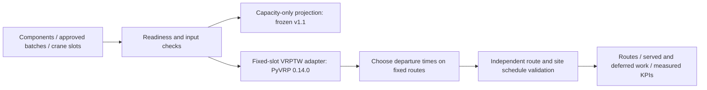

# PrecastFlow — Problem Definition v1

สถานะ: ผู้ใช้อนุมัติหัวข้อและขอบเขตสำหรับ synthetic hackathon prototype แล้ว (2026-09-28) — ดู [decision.json](decision.json)

**ชื่อที่อนุมัติ:** PrecastFlow — จัดเส้นทางส่งพรีแคสต์ตามลำดับติดตั้งและคิวเครน พร้อมเลือกเวลาออกเดินทาง

**ผู้ใช้เป้าหมาย:** ผู้วางแผนขนส่งของโรงงาน/ผู้ประสานงานติดตั้ง รับแผนที่หัวหน้าหน้างานอนุมัติ แล้วจัด batch ลงรถและเลือกเส้นทาง/เวลาออกเดินทาง เป็นสมมติฐานผู้ใช้ที่ยังต้องยืนยันกับผู้ปฏิบัติงาน

**ปัญหา:** แผนที่ส่งครบและบรรทุกไม่เกินอาจยังทำให้ชิ้นงานมาผิดคิวหรือผิดลำดับที่ไซต์ ต้องวัดความสำเร็จจากการให้บริการตามแผนติดตั้งด้วย หลักฐานบริบทอยู่ใน [EVIDENCE.md](EVIDENCE.md)

## ขอบเขตรุ่นแรกที่อนุมัติแล้ว

1 โรงงาน หลายไซต์ วางแผนหนึ่งวัน รถประเภทเดียว แต่ละคันวิ่งหนึ่ง route และกลับโรงงาน ใช้ batch ที่แบ่งไว้ล่วงหน้าและไม่แยก batch ข้ามรถ ทุก batch มีชิ้นงานเรียงตามลำดับที่ไซต์อนุมัติ และมีคิวเครนที่ไม่ซ้อนกันในไซต์เดียวกัน

ระบบตัดสินใจ: batch อยู่รถคันใด, เยี่ยม batch ใดก่อนหลังบนรถแต่ละคัน, ออกจากโรงงานกี่โมง ภายในคิวที่กำหนด ระบบรับ installation sequence และ crane slots เป็น input; ไม่สร้างลำดับเชิงวิศวกรรมโครงสร้างเอง

**JIS ในรุ่นนี้หมายถึงการทำตามลำดับที่กำหนดไว้แล้ว** ไม่ครอบคลุมการหาลำดับใหม่ การจัดหลายเครนร่วมกัน หรือ precedence graph ข้ามไซต์ ผลที่เรียกว่า feasible หมายถึง feasible ภายใต้แบบจำลองนี้

Phase 6 เป็น proof of feasibility ขนาดเล็ก ไฟล์ [feasibility_probe.py](feasibility_probe.py) สาธิตเส้นทางข้อมูลนี้ ส่วน production adapter/schema/การจัดการข้อผิดพลาดทั่วไปเป็นงาน Phase 7–9 ภายใต้หัวข้อและขอบเขตที่อนุมัติแล้ว

## นิยามข้อมูลและ CVRP mapping

| Entity | นิยาม |
|---|---|
| Depot | โรงงานจำลองหนึ่งแห่ง จุดเริ่ม/จบทุก route |
| Component | ชิ้นงานเฉพาะ ID, ชนิด, มิติ, น้ำหนัก, site, installation rank, production readiness |
| Delivery batch / customer node | กลุ่มชิ้นงานต่อเนื่องในลำดับติดตั้ง มีหนึ่ง site และหนึ่ง crane slot; ไซต์เดียวมีได้หลาย node |
| Demand | ผลรวมน้ำหนักทุกชิ้นใน batch ใช้ kg; ไม่ใช้จำนวนชิ้นแทนน้ำหนัก |
| Vehicle / capacity | fleet ที่ระบุชัด ไม่เดาจากชื่อโจทย์; probe ใช้ 6 คัน คันละ 9,000 kg เป็นสมมติฐาน |
| Load plan | ผู้วางแผนอนุมัติการจัดวางและลำดับหยิบก่อนส่งเข้า optimizer; probe สมมติว่าอนุมัติแล้ว |
| Service | การให้บริการ batch ที่เครนใช้เวลา 24 นาทีสมมติ รวม 3 ชิ้น × 8 นาที |
| Release time | เวลาเร็วที่สุดที่ batch พร้อมออกโรงงาน ทุก batch บนรถต้องพร้อมก่อนรถออก |
| Site readiness | boolean ว่าอยู่ในแผนได้หรือไม่ และ earliest service time |
| Crane slot | ช่วงที่ service ของ batch ต้องเริ่มและจบภายในนั้น |
| Route | โรงงาน → delivery batches (อาจอยู่หลายไซต์หรือกลับไซต์เดิม) → โรงงาน |

การรวมทุกชิ้นต่อไซต์เป็น node เดียวทำให้ลำดับ/หลายเที่ยวส่งหายไป การมีหลาย batch ณ พิกัดเดียวกันจึงเป็นส่วนจำเป็นของโมเดล ไม่ใช่ duplicate customer

## ข้อจำกัดและวัตถุประสงค์

ให้ `q_j` เป็นมวล batch, `s_j` เวลาเริ่ม service, `p_j` เวลา service และ `r_j` เวลา release:

- ทุก eligible batch ถูกส่งครั้งเดียว ไม่แยก และรถแต่ละคันมี `sum(q_j) <= Q`
- ทุก route เริ่ม/จบ depot, จำนวน route ไม่เกิน fleet และอยู่ภายใน shift
- `departure(route) >= max(r_j)` ของทุก batch บน route
- `slot_start_j <= s_j` และ `s_j + p_j <= slot_end_j`
- ภายในไซต์เดียว `finish(batch k) <= start(batch k+1)` ตรวจข้ามรถด้วย
- คิวของไซต์เดียวถูกกำหนดให้ `slot_end_k <= slot_start_(k+1)` ล่วงหน้า จึงรับประกันลำดับและไม่ใช้เครนซ้อนกัน หากคิวซ้อนกัน probe ตอบ **unsupported** ไม่ได้บอกว่าโจทย์ infeasible
- ภายใน batch มีลำดับติดตั้งตายตัวและสมมติว่าหยิบชิ้นงานได้ตามลำดับ การตรวจ geometry/packing/crane reach ยังอยู่นอกโมเดล

**Objective ใน probe:** ลดระยะทางของแผนที่ผ่านข้อจำกัดทั้งหมด จากนั้นเลือกเวลาออกของ route ที่ได้เพื่อลด `travel minutes + waiting minutes` โดยรักษา route/fleet/jobs เดิม นี่เป็นวิธีสองขั้น ไม่ได้พิสูจน์ joint optimum และยังไม่ใช่ carbon minimization

PyVRP `tw_late` จำกัดเวลาเริ่ม service จึงต้องส่งค่า `slot_end - service_duration` เข้า API ถ้าใช้ `slot_end` ตรง ๆ งานอาจเสร็จหลังเครนหมดคิว

ข้อมูล `.vrp` ของ frozen core รองรับ pure CVRP เท่านั้น ไม่มีการใส่ field time window แล้วหวังว่า parser เดิมจะอ่านเอง ส่วน extension ใช้ Python model API แยกใน Phase 6 และระบุชัดว่าใช้ search budget ต่างจาก core (2,000 no-improvement / 10,000 max iterations สำหรับ probe)

## Readiness และการหาคำตอบไม่เจอ

ถ้า batch ไม่พร้อม ให้เลื่อน batch นั้นและ successors ของไซต์เดียวกัน แสดงรายการและจำนวนชิ้นงานที่เลื่อนออกมา ห้ามซ่อน demand ที่ไม่ได้ส่งแล้วอ้างว่างานสำเร็จทั้งหมด ทุกวิธีที่ใช้เปรียบเทียบต้องใช้ eligible set เดียวกัน

- `PROVEN_INFEASIBLE_*`: ใช้เมื่อมีเหตุผลตรวจได้ เช่น batch หนักกว่ารถ, มวลรวมเกิน fleet ในโมเดล single-trip, service ยาวกว่าคิว
- `NO_FEASIBLE_SOLUTION_FOUND`: engine ยังหาแผนไม่ได้ตาม budget ไม่ใช่ข้อพิสูจน์ว่าไม่มีคำตอบ
- `UNSUPPORTED_*` / `INPUT_REQUIRES_*`: อยู่นอก scope หรือขาด input ที่ต้องใช้

## GreenSlot ที่ทำได้ใน gate นี้

ข้อมูลระยะทางเป็น Euclidean บนแผนที่สมมติ ไม่ใช่ถนนจริง แบบจำลองจราจรใช้ 20 km/h ใน 07:00–09:00 และ 16:00–18:00, 40 km/h ช่วงอื่น เป็นสมมติฐานล้วน

คำนวณการเคลื่อนที่ทีละนาทีตามนาฬิกาของทุก leg จึงผ่านการทดสอบ FIFO ที่รอยต่อ rush hour ทดลองเวลาออกทุกนาทีในช่วงที่เป็นไปได้สำหรับ route เดิมและตรวจ schedule ใหม่ทั้ง route กรณีนี้ไม่มีเครนแชร์ข้ามไซต์และคิวในไซต์ไม่ซ้อนกัน จึงเลือกเวลาออกแยกแต่ละ route ได้

ไม่ใช้ speed matrix ตามเวลาออกต้น route แล้วตรึงไว้ทั้งวัน การทำ traffic-aware routing เต็มรูปแบบร่วมกับการเปลี่ยน route และความไม่แน่นอนยังไม่ผ่าน gate นี้

## KPIs และวิธีพิสูจน์คุณค่าในเฟสต่อไป

| KPI | ขอบเขต |
|---|---|
| Served / deferred components | ต้องแสดงควบคู่กับทุกผลเปรียบเทียบ |
| Feasibility / late batches / sequence violations / crane overlaps | Phase 6 ตรวจได้แล้วในแบบจำลองคิวคงที่ |
| Total distance / vehicles / travel / truck waiting | Phase 6 มีผลดิบ รองรับการหักล้างข้อกล่าวอ้างว่าทุก KPI ต้องดีขึ้นเสมอ |
| Crane idle / rehandling | ต้องสร้างแบบจำลองสถานะเครนและจัดเก็บก่อน จึงยังไม่รายงานเป็นผลวัด |
| Fuel / CO₂ / cost | ต้องมี calibration และแหล่งอ้างอิงตาม Phase 10–12 ยังไม่ใส่เปอร์เซ็นต์ลดใน Phase 6 |

Carbon model ที่จะประเมินต้องแยกการเดินทางตามชนิดรถ มวลคงเหลือและความเร็ว กับช่วงติดเครื่องรอ การลดเวลารอไม่ได้แปลว่าลด CO₂ ตามสัดส่วนเดียวกันถ้ารถดับเครื่อง ระบุขอบเขต tailpipe CO₂ หรือ CO₂e ให้ตรงกับ emission factor และไม่รวม embodied carbon ของการผลิตคอนกรีตโดยปริยาย

Phase 10 เปรียบเทียบอย่างน้อย naive/current-planning simulation, nearest neighbor และ standard CVRP โดยมีการทำ schedule ให้ทุกวิธีอยู่ภายใต้ข้อจำกัดเดียวกัน หรือแสดง feasibility violations อย่างเปิดเผย พร้อมแยก ablation: capacity-only → fixed slots → departure choice การเทียบกับแผนที่ผิดข้อจำกัดใช้สาธิตปัญหา ไม่ใช้คำนวณ savings ว่าชนะวิธีที่ใช้งานได้จริง

## ขอบเขตที่ต้องยืนยันก่อนขยาย

ก่อน pilot จริงต้องยืนยัน batching, load plan และ compatibility, เวลายกจริง, production release, route accessibility, crane slots, ถนน/เวลาเดินทาง และเชื้อเพลิง ถ้าไซต์ต้องรับทีละเต็มคันจนแทบไม่มี multi-stop ให้ประเมิน CVRP fit ใหม่ เพราะปัญหาอาจกลายเป็น dispatch/scheduling เป็นหลัก

Backhaul, EV, หลายโรงงาน, arbitrary precedence, 3D packing, realtime rescheduling และ multi-trip fleet เป็นงานนอก MVP ที่อนุมัติ

**Fallback ภายในหัวข้อเดียวกัน:** หากการได้ crane sequence จากไซต์ไม่สมจริง ให้ลดชื่อและ scope เป็น Precast Delivery with Site Time Windows และเอา JIS ออกจาก claim ก่อนพัฒนา ถ้า routing fit หายไปจริงจึงกลับไปพิจารณาหัวข้อสำรอง
