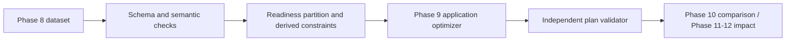

# PrecastFlow — Data and Constraint Contract 1.0

ฐาน: [ขอบเขตที่ผู้ใช้อนุมัติ](../phase6_topic_selection/decision.json) และ [Problem Definition v1](../phase6_topic_selection/PROBLEM_DEFINITION_V1.md)

Phase 7 กำหนดข้อมูลและตรวจข้อจำกัดให้เรียกใช้ซ้ำได้ ส่วนการเตรียมข้อมูลทดลองหลายชุดเป็น Phase 8 และการทำ optimizer ของ application เป็น Phase 9

## ขอบเขตและหน่วย

หนึ่ง planning day, หนึ่ง depot, รถประเภทเดียวที่มี payload เท่ากัน, หนึ่ง route ต่อรถ, หนึ่งเครนอิสระต่อไซต์, approved indivisible batches และ fixed installation sequence/crane slots ใช้ตัวเลขจำนวนเต็ม: kg, m และนาทีหลังเที่ยงคืนของวันวางแผนเดียวกัน ช่วงเวลา 0–1440 ไม่มี overnight หรือ timezone conversion ใน contract รุ่นนี้

เวลา service เป็นช่วง `[start, end)` งานที่จบ 10:00 และอีกงานเริ่ม 10:00 ใช้เครนต่อกันได้ การให้บริการต้องเสร็จภายใน crane slot และรถต้องกลับ depot ภายใน shift

Schemas ที่เครื่องมือทั่วไปอ่านได้: [case.schema.json](schemas/case.schema.json), [plan.schema.json](schemas/plan.schema.json) ส่วนความสัมพันธ์ข้าม record และข้อจำกัดเชิง operation ตรวจด้วย [contract.py](contract.py) และ [validate_contract.py](validate_contract.py) โค้ดตรวจ schema ในโครงการรองรับ keyword ที่ใช้ในสอง schema นี้เท่านั้น ไม่ใช่ JSON Schema engine ทั่วไป

## Input — แหล่งข้อมูลเดียวต่อความหมาย

ตัวอย่างเต็ม: [normal.input.json](examples/normal.input.json)

| Field | ความหมาย/กติกา |
|---|---|
| `schema_version` | ต้องเป็น `1.0`; field แปลกหรือสะกดผิดถูกปฏิเสธ ไม่ทิ้งเงียบ |
| `case_id` | ID ของกรณีวางแผน อ่านคู่กับ hash ของ input revision |
| `data_kind` | `synthetic`, `mixed`, `measured`; ถ้ามี source ชนิด assumption ห้ามประกาศ measured |
| `units` | `mass=kg`, `distance=m`, `time=minute_after_midnight` ตายตัว; ผู้เตรียมข้อมูลต้องแปลงหน่วยก่อน |
| `sources[]` | `source_id`, `kind`, `reference` โดย kind เป็น assumption/derived/measured/published; ตรวจ reference ID ไม่ได้ยืนยันความจริงของแหล่งโดยอัตโนมัติ |
| `depot.location_id` | depot เดียวโดยโครงสร้าง object ไม่ใช่รายการหลาย depot |
| `sites[]` | `site_id`, `location_id`, `crane_id`; crane ต้องไม่แชร์ข้ามไซต์ในรุ่นนี้ |
| `fleet` | `vehicle_ids[]` ระบุรถจริงแต่ละคันในโมเดล, `capacity_kg`, `shift_start_min`, `shift_end_min`, `source_id`; รถ 0 คันเป็น input ที่อ่านได้ แต่มีงานแล้วอาจพิสูจน์ infeasible |
| `components[]` | `component_id`, `site_id`, `weight_kg`, `installation_rank`, `production_ready`, `release_min`, `source_id` |
| `batches[]` | `batch_id`, `site_id`, `component_ids[]`, `sequence`, `service_min`, `slot_start_min`, `slot_end_min`, `site_ready`, `site_ready_min`, `load_plan_approved`, `source_id` |
| `travel` | `location_ids[]`, `distance_m[][]`, `duration_upper_min[][]`, `mode`, `speed_bands[]`, `source_id` |

**ไม่มี `batch.weight_kg` หรือ `batch.release_min` ใน input:** คำนวณ demand จากผลรวมน้ำหนักชิ้นงาน และ release จากเวลาพร้อมออกที่ช้าที่สุดใน batch ช่วยป้องกันกรณีแก้น้ำหนักชิ้นงานแล้วลืมแก้น้ำหนัก batch ค่า derived เหล่านี้มีใน prepared output เท่านั้น

น้ำหนักจริงควรมาจาก packing list; synthetic data คำนวณตามสมมติฐานและปัดขึ้นเป็น kg ก่อนบันทึก ตัวตรวจไม่แปลง string, float, tonne หรือ boolean เป็นจำนวน kg โดยปริยาย JSON reader ปฏิเสธ duplicate keys, NaN และ Infinity

ทุก component ต้องอยู่ใน batch เดียวของไซต์เดียวกัน `component_ids` มีลำดับตามการติดตั้ง ภายในแต่ละไซต์ batch sequence ต้องเป็น 1..B และ installation ranks ที่ต่อทุก batch ตามลำดับต้องเป็น 1..N แบบต่อเนื่อง ตัวเลขนี้คืออันดับใน planning horizon ปัจจุบัน ผู้เตรียมข้อมูลเก็บ original BIM/task IDs แยกในแหล่งข้อมูลได้ ห้ามข้าม predecessor ภายใน horizon เพื่อทำให้เคสดู feasible

`production_ready=true` หมายถึงอนุญาตให้นำชิ้นงานเข้าแผนโดยใช้ release time ที่ระบุ ไม่ได้แปลว่าเสร็จอยู่แล้ว ณ เวลาที่รันโปรแกรม `release_min` คือ earliest departure ที่ชิ้นงานพร้อมบรรทุกออก รวมเวลา loading ที่จำเป็นไว้ก่อนแล้ว หากยังไม่ยืนยันการผลิตให้ false และเลื่อนงานออกอย่างเปิดเผย

`load_plan_approved` เป็นเงื่อนไขที่ผู้เตรียมข้อมูลยืนยัน/สมมติสำหรับโมเดล รถทุกคันถูกถือว่าใช้กับ batch ที่รับเข้ามาได้ ยังไม่ตรวจ geometry, การรัดตรึง, axle load, ลำดับหยิบจริง หรือการจัด batch หลายชุดบนรถทางกายภาพ จึงใช้คำว่า feasible ภายใต้โมเดล ไม่ใช้เป็นใบอนุญาตให้จัดรถจริง

## Travel interface

ตารางสองชุดเป็น square matrices ตาม `location_ids` ลำดับเดียวกัน มี diagonal เป็น 0 และสมาชิกไม่ติดลบ รองรับระยะขาไป/กลับไม่เท่ากัน ไม่บังคับ symmetry หรือ triangle inequality ไซต์เดียวมีหลาย batch ที่อ้าง location เดียวกันได้

- **STATIC_MATRIX:** `duration_upper_min` คือเวลาเดินทางที่ใช้จริงในโมเดล; `speed_bands=[]`
- **FIFO_SPEED_BANDS:** ทุก band มี `start_min`, `end_min`, `speed_kmh` เป็นจำนวนเต็มบวก เรียงและต่อกันครอบคลุม `[0,1440)` ใช้ความเร็วร่วมทั้งเครือข่าย เป็นแบบจำลองจำลองอย่างง่ายสำหรับ departure-time choice

Dynamic mode เคลื่อนที่ทีละนาทีโดยหัก `speed_kmh × 1000` ออกจาก `distance_m × 60` จนครบระยะ ใช้เวลาเริ่มแต่ละ leg หลัง service ของ leg ก่อนหน้า ไม่ตรึง traffic ตามเวลาออกจากโรงงานครั้งเดียว การเดินทางที่ข้ามวันไม่มี profile รองรับจะไม่ผ่านตัวตรวจ

`duration_upper_min[i][j] >= ceil(distance_m[i][j] × 60 / (min_speed_kmh × 1000))` ใน dynamic mode เพื่อให้ Phase 9 ใช้เป็นเวลาขอบบนใน static VRPTW ได้ กฎนี้ conservative; แผนที่หาไม่เจอภายใต้ upper bounds **ไม่ใช่** proof ว่า dynamic case ไม่มีคำตอบ

ยังไม่รองรับ arc ที่ไปไม่ได้ผ่านค่า null/Infinity, vehicle-specific road access หรือ traffic ต่างกันรายถนน หากข้อมูลเหล่านี้จำเป็นให้ระบุเป็น scope change ก่อนเพิ่ม schema

## ลำดับ constraint preparation

1. ตรวจ schema, หน่วย, ID ไม่ซ้ำ, references, matrix และ source labels
2. ตรวจ component coverage, batch/rank ordering และ fixed nonoverlapping slots **ของงานที่ร้องขอทั้งหมด** รวมงานที่อาจเลื่อน เพื่อไม่ซ่อนข้อมูลผิดไว้ในรายการ deferred
3. เดิน batch ตาม sequence ต่อไซต์ ถ้าชิ้นงานใดไม่พร้อมหรือ batch มี `site_ready=false` ให้เลื่อน batch นั้นและ successors ทั้งหมดของไซต์ บันทึก reason และ `blocked_by_batch_id`
4. สำหรับ eligible batches คำนวณ `demand_kg`, `release_min`, `tw_early_min=max(slot_start_min,site_ready_min)`, `tw_late_min=slot_end_min-service_min`
5. ตรวจ approved load assumption ของ eligible work แล้วตรวจ necessary conditions ที่พิสูจน์ได้ ได้แก่ batch capacity, total fleet capacity และช่วง service ที่เป็นไปไม่ได้แม้เวลาเดินทางเป็นศูนย์

ผลจาก [prepare_case()](contract.py) มี `eligible_batches`, `deferred_batches`, counts/มวลรวม, issues และ input hash จึงส่งต่อให้ solver ได้โดยไม่ให้แต่ละ baseline เลือก eligible work คนละชุด

| Preparation status | ความหมาย/การจัดการ |
|---|---|
| `READY` | รับไปค้นหาแผนได้ ยังไม่ได้บอกว่ามีคำตอบแน่นอน |
| `NO_ELIGIBLE_WORK` | ไม่มีงานพร้อมส่ง แสดงงาน deferred; ไม่เรียก solver ด้วย instance ว่าง |
| `INVALID_INPUT` | เช่นหน่วยผิด ID ซ้ำ น้ำหนักไม่เป็น integer reference หาย matrix ผิด หรือ sequence ขาด |
| `UNSUPPORTED_INPUT` | เช่น shared crane, คิวติดตั้งซ้อน หรือ eligible batch ยังไม่มี approved load plan; ห้ามเรียกว่าโจทย์ไม่มีคำตอบ |
| `PROVEN_INFEASIBLE` | มี witness ของเงื่อนไขจำเป็นที่ผิดในโมเดลนี้ แสดง issue code และรายละเอียด |

ตัวอย่าง proof: batch 9,001 kg บนรถ 9,000 kg หรือ demand รวม 51,156 kg แต่รถ single-trip บรรทุกได้รวม 45,000 kg ส่วนโจทย์ 3 batch × 2,000 kg กับรถ 2 × 3,000 kg ผ่าน aggregate check แต่จัดลงจริงไม่ได้ จึงยังตอบ READY ได้ถูกความหมาย — precheck ไม่ใช่ exact bin-packing solver

## ข้อจำกัดที่ plan validator ตรวจ

| ID | Constraint | ตรวจอย่างไร |
|---|---|---|
| C01 | Eligible coverage | ทุก batch ครั้งเดียว ไม่มี unknown/deferred batch บน route |
| C02 | Fleet identity / single trip | ใช้เฉพาะ vehicle ID ที่มี และใช้คันเดิมซ้ำหลาย route ไม่ได้ |
| C03 | Payload | ผลรวมมวลทุก batch บน route ≤ capacity; delivery-only จึงบรรทุกมากสุดตอนออก depot |
| C04 | Release | รถออกหลัง component release ที่ช้าที่สุดของทุก batch บนรถ |
| C05 | Travel continuity | arrival ตรงกับ end ของ stop ก่อนหน้า + travel model ณ เวลานั้น |
| C06 | Service timing | start ≥ arrival, end = start + service duration |
| C07 | Readiness / crane slot | service เริ่มหลัง site-ready และเริ่ม/จบภายใน slot |
| C08 | Installation sequence | เทียบ finish/start ของ batches ตามอันดับ **ข้ามรถ** |
| C09 | Crane exclusivity | service intervals ของไซต์เดียวกันไม่ทับกัน **ข้ามรถ** |
| C10 | Depot and shift | คำนวณ leg แรกจาก depot/leg สุดท้ายกลับ depot และเช็ก shift |
| C11 | Reported metrics | คำนวณ distance/travel/wait/vehicles/component counts ซ้ำ |
| C12 | Request identity | case ID และ SHA-256 ต้องตรงกับ input revision ปัจจุบัน |
| C13 | Deferred/unserved visibility | รายงานงานเลื่อนครบ; ถ้าหาคำตอบไม่เจอต้องแสดง eligible work ที่ยังไม่ส่ง |

slot ที่ไม่ทับกันช่วยรับประกัน sequence ตาม input แต่ตัวตรวจยังตรวจ C08/C09 ซ้ำจากเวลาที่แผนรายงาน เพื่อจับ adapter หรือ schedule ที่ผิด การรอที่ไซต์นานกว่า earliest service ทำได้ตราบใดที่ผ่านข้อจำกัดทั้งหมด; ค่ารอ = start − arrival และต้องรายงานตามจริง

## Output plan

ตัวอย่าง: [normal.output.json](examples/normal.output.json) และ [readiness.output.json](examples/readiness.output.json)

| Field | ความหมาย |
|---|---|
| `schema_version`, `case_id`, `input_sha256` | รุ่นของ contract และ input revision ที่แผนนี้แก้ |
| `status` | FEASIBLE / NO_ELIGIBLE_WORK / NO_FEASIBLE_SOLUTION_FOUND |
| `served_batch_ids`, `deferred_batch_ids`, `unserved_eligible_batch_ids` | แยกผลงานที่ส่งแล้ว เลื่อนก่อนค้นหา และงานที่ต้องส่งแต่ยังไม่มีคำตอบ |
| `routes[]` | `vehicle_id`, `departure_min`, `return_min`, `distance_m`, `stops[]`; start/end depot กำหนดโดย contract |
| `stops[]` | `batch_id`, `arrival_min`, `start_min`, `end_min` |
| `metrics` | distance_m, travel_min, waiting_min, vehicles_used, served_components, deferred_components; เป็น null เมื่อค้นหาไม่สำเร็จ |

Hash ใช้ SHA-256 ของ UTF-8 JSON แบบเรียง object keys และไม่ใส่ช่องว่าง โดยคงลำดับ arrays ไว้ ถ้า input เปลี่ยนแม้เพียง readiness ต้องประเมินแผนใหม่; validator ไม่ถือว่าคำตอบเก่ายังใช้ได้อัตโนมัติ

**FEASIBLE หมายถึงส่ง eligible work ครบตามโมเดล** อาจยังมี deferred work; validator แยก `all_requested_served` ออกมา ถ้า 36 ชิ้นถูกเลื่อน 6 ชิ้นจะได้ feasible_for_eligible_work=true แต่ all_requested_served=false

**NO_FEASIBLE_SOLUTION_FOUND** ใช้ routes=[], served=[], unserved_eligible=งานที่พร้อมทั้งหมด และ metrics=null ห้ามรายงาน distance=0 เป็นผลสำเร็จ ตัวตรวจอาจบอก valid=true เพราะรูปแบบรายงาน failure ถูก แต่ feasible_for_eligible_work=false การค้นหาจริงและ budget ต้องแนบใน experiment metadata ของ Phase 9/10

NO_ELIGIBLE_WORK มี route ว่างและ metrics การเดินทางเป็นศูนย์ แต่ต้องรายงาน deferred components ครบ; ไม่ใช้เคสนี้คำนวณ improvement เทียบกับแผนที่ส่งงานมากกว่า ส่วน INVALID_INPUT/UNSUPPORTED_INPUT/PROVEN_INFEASIBLE เป็น preparation envelope ก่อนถึงขั้น plan

## Architecture / Objective handoff



Phase 9 รับเฉพาะ READY และใช้ eligible batches ชุดเดียวกันทุกวิธี เริ่มด้วย objective ลดระยะทางภายใต้ hard constraints แล้วเลือก departure เพื่อลด travel+waiting บน route เดิมตาม scope ที่ยืนยัน การเพิ่มต้นทุน/คาร์บอนต้องมีข้อมูลอ้างอิงก่อนและต้องรายงานว่าเป็นวิธีสองขั้น ไม่ใช่ joint optimum

PyVRP adapter ต้องแปลง `tw_late_min=slot_end-service` และใช้ release ของทุกชิ้นงานบนรถ พร้อมรักษา node-to-batch mapping แม้หลาย batch อยู่ location เดียวกัน Standard CVRP ablation ต้องใช้ matrix และ eligible workload ชุดเดียวกับ Application Mode; หากเป็น road matrix จะส่งเข้า frozen EUC_2D wrapper แล้วเปรียบเทียบตรง ๆ ไม่ได้

CORE-CVRP v1.1 ยังเป็น frozen baseline/Mission 2 engine แยกจาก contract นี้ Phase 7 ไม่ได้แก้ solver และไม่ได้นำ validator นี้มาแทน validator ของ frozen benchmark

## CLI และ exit status

```powershell
python phase7_constraints/validate_contract.py phase7_constraints/examples/normal.input.json
python phase7_constraints/validate_contract.py phase7_constraints/examples/normal.input.json --plan phase7_constraints/examples/normal.output.json
python phase7_constraints/verify_phase7.py
```

คำสั่งตรวจคืน JSON และ exit 0 เมื่อ input อยู่ใน READY/NO_ELIGIBLE_WORK หรือ plan envelope ตรวจผ่าน; exit 2 เมื่อไม่ผ่านหรือ input อยู่ในสถานะที่ส่งเข้า solver ไม่ได้ ผู้เรียกต้องอ่าน status/feasible_for_eligible_work เสมอ เพราะ exit 0 ของ failure envelope ไม่ได้แปลว่ามี solution

ตัว validator ใช้ Python standard library ส่วน verify_phase7 ตรวจ freeze_id ของ environment Phase 5 ด้วยจึงต้องมี PyVRP เวอร์ชันเดิมตามโครงการ
